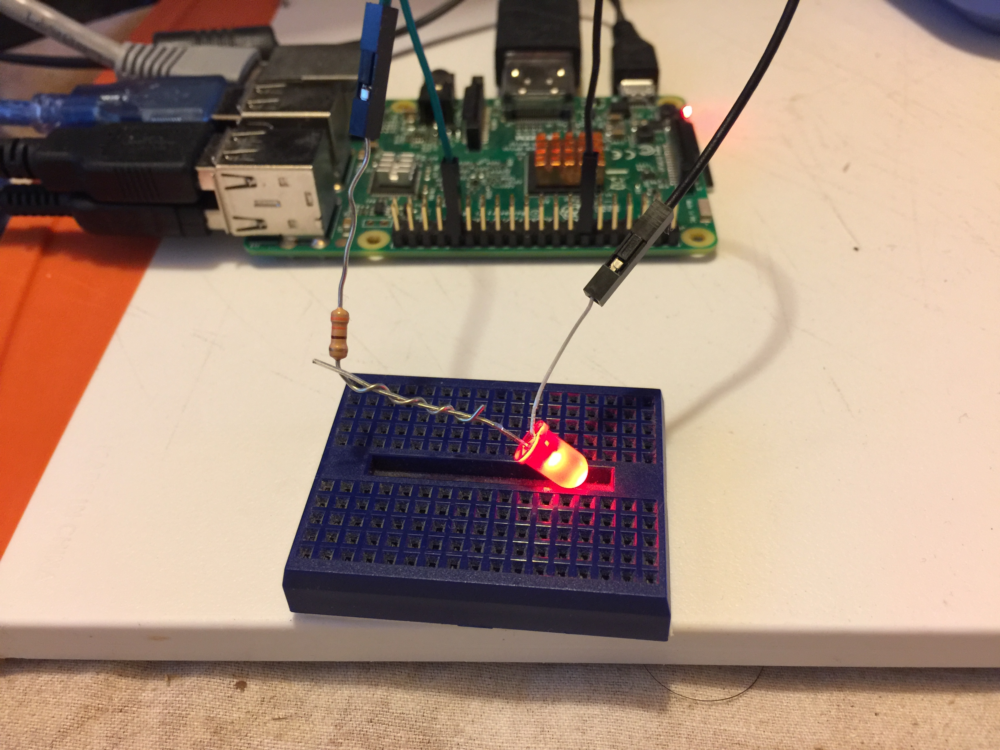

# bot-pie
BitcoinOfThings.com with Raspberry Pie

Control a LED with Bitcoin



# Install
```
git clone https://github.com/bitcoinofthings/bot-pie
```
Your Raspberry Pi has to be setup to allow programming of the GPIO pins.  
Install requirements...
```
pip install paho-mqtt
```
The code uses PIN 32 for the LED. Adjust the pin number for whichever GPIO you are using to drive the LED.  

Run the app...
```
python bot_led.py
```
Then send messages (0 or 1) to the bot_demo topic. You may use the demo web page at https://demo.bitcoinofthings.com.  
Or send the command using mosquitto client.
```
mosquitto_pub -h mqtt.bitcoinofthings.com -p 1883 -u demo -P demo -t "bot_demo" -m "{\"clientId\":\"demo\", \"message\":\"1\"}" -d
```