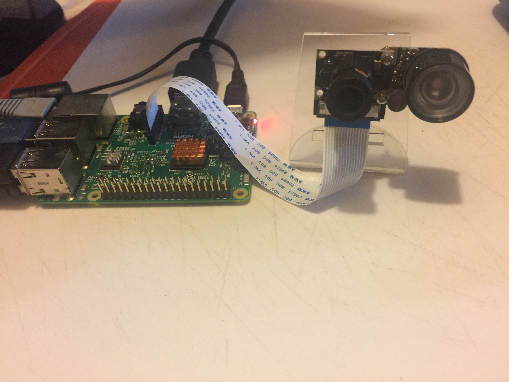
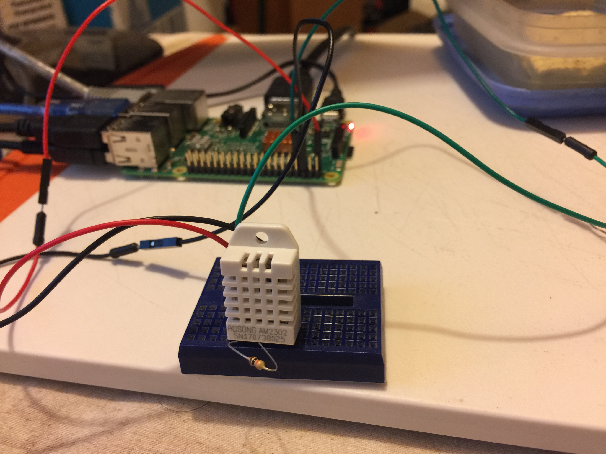

# bot-pi
BitcoinOfThings.com with Raspberry Pi

Control stuff with Bitcoin

Camera  

LED  

DHT22 Temperature sensor  


# Install
```
git clone https://github.com/bitcoinofthings/bot-pi
```
Your Raspberry Pi has to be setup to allow programming of the GPIO pins.  
Install requirements...
```
pip install paho-mqtt
```
## Create a picture feed
Connect a camera to your Pi. Remember to enable it in `sudo raspi-config`. Test it using `raspistill -o pic.jpg`.  
For video, install the converter...
```
sudo apt-get install -y gpac
```
Run the app that uploads pics to BOT...
```
python bot_cam.py
```
If you want to run and view a video file locally (requires source edit)...
```
MP4Box -add bot.h264 bot.mp4
omxplayer bot.mp4
```
## Control a LED
The code uses PIN 32 for the LED. Adjust the pin number for whichever GPIO you are using to drive the LED.  

Run the app...
```
python bot_led.py
```
Then send messages (0 or 1) to the bot_demo topic. You may use the demo web page at https://demo.bitcoinofthings.com.  
Or send the command using mosquitto client.
```
mosquitto_pub -h mqtt.bitcoinofthings.com -p 1883 -u demo -P demo -t "bot_demo" -m "{\"clientId\":\"demo\", \"message\":\"1\"}" -d
```

## Create a data stream
Using a DHT22 temperature and humidity sensor we can create a data stream for BOT. Wire up your Pi and sensor as shown in https://pimylifeup.com/raspberry-pi-humidity-sensor-dht22/  

Then
```
python bot_dht22.py
```
Once your data stream is published to BOT then you can charge subscribers for access to the data stream.
